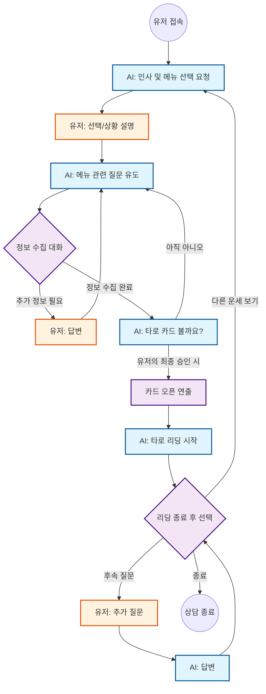

### 2025-12-22(월)
- 깃허브 테스트

### 2025-12-23(수)
- 발표 자료 준비
- 타로봇 다이어그래(플로우차트 작성)

### 2025-12-26(금)
- 프로젝트 최종본 등록

```mermaid
flowchart TD
    %% 노드 스타일 정의
    classDef ai fill:#e1f5fe,stroke:#01579b,stroke-width:2px;
    classDef user fill:#fff3e0,stroke:#e65100,stroke-width:2px;
    classDef process fill:#f3e5f5,stroke:#4a148c,stroke-width:2px;

    Start((유저 접속)) --> Greeting[AI: 인사 및 메뉴 선택 요청]:::ai
    Greeting --> UserSelect[유저: 선택/상황 설명]:::user
    UserSelect --> Guide[AI: 메뉴 관련 질문 유도]:::ai
    
    %% 대화 반복 구간
    Guide --> ChatLoop{정보 수집 대화}:::process
    ChatLoop -- 추가 정보 필요 --> UserAnswer[유저: 답변]:::user
    UserAnswer --> Guide
    
    ChatLoop -- 정보 수집 완료 --> AskOpen[AI: 타로 카드 볼까요?]:::ai
    AskOpen -- 아직 아니오 --> Guide
    AskOpen -- 유저의 최종 승인 시--> Reveal[카드 오픈 연출]:::process
    
    Reveal --> Reading[AI: 타로 리딩 시작]:::ai
    Reading --> PostAction{리딩 종료 후 선택}:::process
    
    PostAction -- 후속 질문 --> SubQ[유저: 추가 질문]:::user
    SubQ --> SubAns[AI: 답변]:::ai
    SubAns --> PostAction
    
    PostAction -- 다른 운세 보기 --> Greeting
    PostAction -- 종료 --> End((상담 종료))
```
